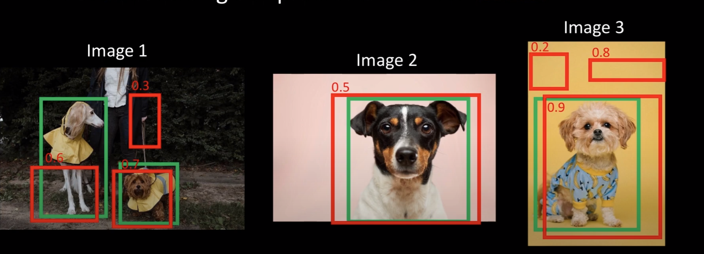
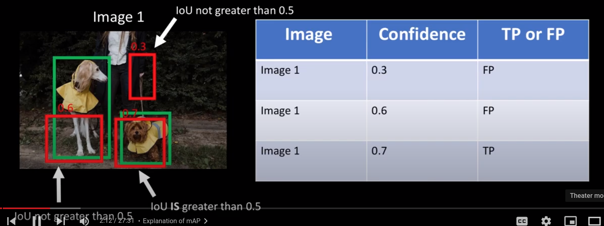
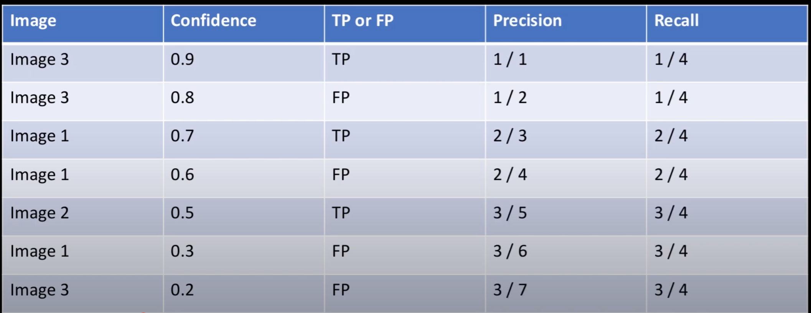
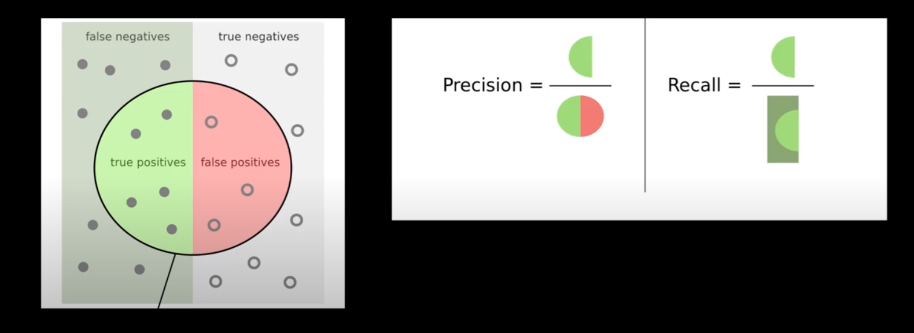
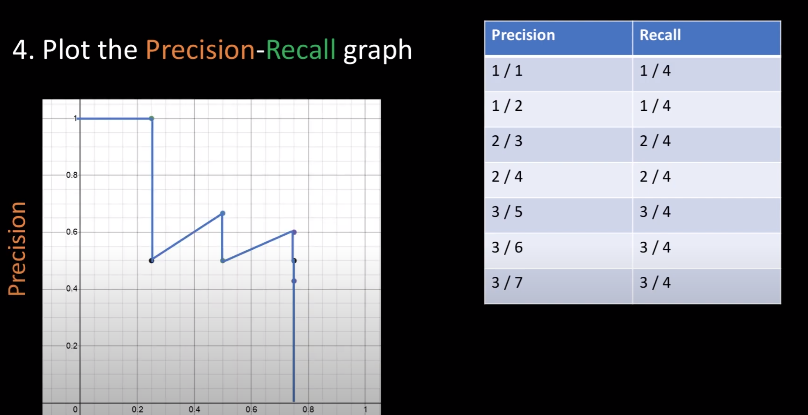

## summary from https://www.youtube.com/watch?v=FppOzcDvaDI&list=PLhhyoLH6IjfxeoooqP9rhU3HJIAVAJ3Vz&index=46






## mean_avg_precision
- [test_mean_avg_precision.py](test_mean_avg_precision.py)
- https://www.youtube.com/watch?v=FppOzcDvaDI&list=PLhhyoLH6IjfxeoooqP9rhU3HJIAVAJ3Vz&index=46
- api적이다

    ```
    preds = [
      # train_idx, class_prediction, prob_score, x, y, width, height 
      [0, 0, 0.9, 0.55, 0.2, 0.3, 0.2],
    ]
    targets = [
      [0, 0, 0.9, 0.55, 0.2, 0.3, 0.2],
    ]

    map:float = mean_average_prediction(
      preds, 
      targets, 
      io_threshold=0.5, 
      box_format="midpoint", 
      num_classes=1
    )
    ```

    
## objdetecteval module 
- [test_objdetecteval.py](test_objdetecteval.py)
- https://github.com/alexhock/object-detection-metrics
- 결과가 문서적이다


    ```
    from objdetecteval.metrics.coco_metrics import get_coco_stats
    
    # {prediction, target}_{image_ids, class_labels, bboxes, class_confidences}
    batch = {
        "prediction_image_ids": [0, 1],
        "predicted_class_labels": [
            [0, 0],
            [1, 0],
        ],
        "predicted_bboxes": [
            # image 0
            [
	        [750.65, 276.56, 963.77, 369.68], 
		[60, 60, 50, 50]
	    ],
            # image 1
            [
	        [1750.65, 276.56, 1963.77, 369.68], 
		[60, 60, 50, 50]
	    ],
        ],	
        "predicted_class_confidences": [[0.6, 0.3], [0.6, 0.3]],

        "target_image_ids": [0, 1],
        "target_class_labels": [
            [0],
            [1],
        ],
        "target_bboxes": [
            # image 0
            [
                [750.65, 276.56, 963.77, 369.68],
            ],
            # image 1
            [
                [750.65, 276.56, 963.77, 369.68],
            ],
        ],
    }

    coco_results = get_coco_stats(**batch)
    coco_results['ALL']
    coco_results[0] # class 0
    coco_results[1] # class 1
    
    coco_results[0] == {
      'AP_all': 0.5,
      'AP_all_IOU_0_50': 0.5,
      ...
    }
    ```


## mean_average_precision module 
- [metricbuilder_mAP.ipynb](metricbuilder_mAP.ipynb)
- https://github.com/bes-dev/mean_average_precision
- image_id를 어떻게 처리하는지 모르겠다.
- add로 추가하고, value를 호출해서 metric을 구하는 방식(add를 여러번 할 수 있다면 incremental적)
- pascal coco mAP를 구할 수 있다.

    ```
    from mean_average_precision import MetricBuilder
    # [xmin, ymin, xmax, ymax, class_id, difficult, crowd]
    gt = np.array([
      [439, 157, 556, 241, 0, 0, 0],
      ...
    ]

    # [xmin, ymin, xmax, ymax, class_id, confidence]
    preds = np.array([
      [429, 219, 528, 247, 0, 0.460851],
      ...
    ]
    metric_fn = MetricBuilder.build_evaluation_metric("map_2d", async_mode=False, num_classes=1)
    metric_fn.add(preds, gt)


    # compute PASCAL VOC metric at the all points
    print(f"VOC PASCAL mAP in all points: {metric_fn.value(iou_thresholds=0.5)['mAP']}")
    ```

## map
- https://github.com/aladdinpersson/Machine-Learning-Collection/blob/master/ML_tests/Object_detection_tests/map_test.py

